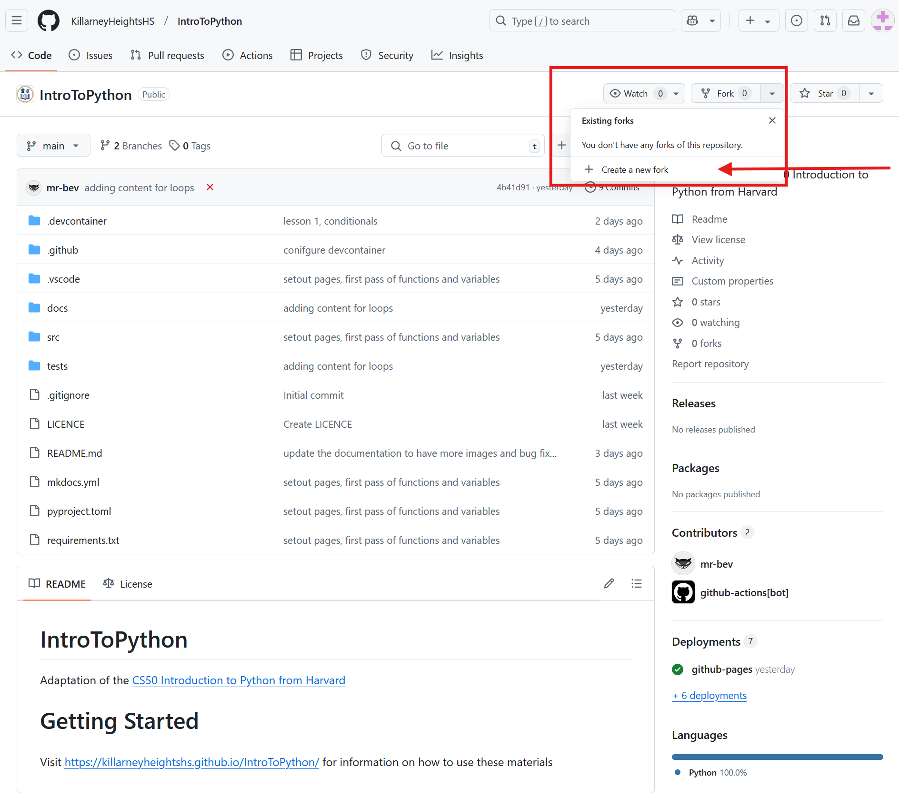
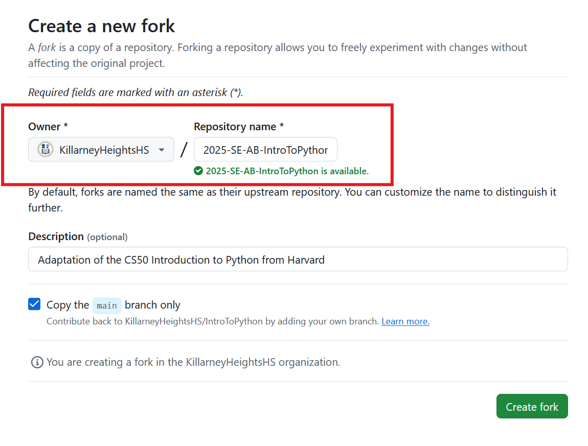
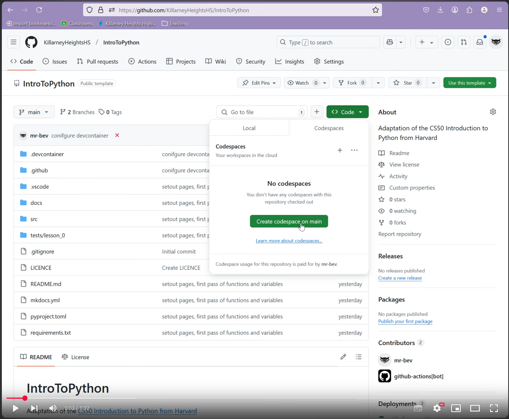
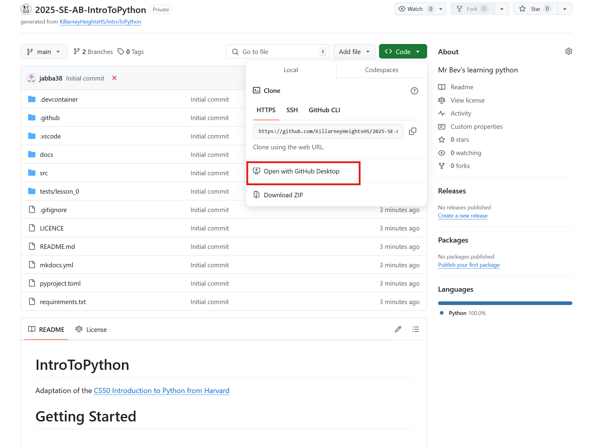

# Overview

This is an adaptation of the [CS50 Introduction to Python](https://cs50.harvard.edu/python/2022/) course from Harvard. The course covers the basics of Python programming, including data types, control structures, functions, and more. It also includes additional sections that align with the [NSW Stage 6 Software Engineering](https://curriculum.nsw.edu.au/learning-areas/tas/software-engineering-11-12-2022/overview) curriculum.

## Getting Started

To get started with the course, follow these steps:

1. Fork this repository by clicking the "Fork" button on GitHub. This will create a copy of the repository in your own account.


    !!! success "Naming Convention for Repositories"
        - Follow the naming convention `<year>-<subject>-<your_initials>-IntroToPython` for your forked repository.
        - For example, `2025-11SEO4-AB-IntroToPython`

    

2. Complete the details of the repository. Ensure that:
    - The owner is set to `KillarneyHeightsHS`.
    - You have used the naming convention above for your repository.

    

    then click on **Fork repository**.

### Codespaces
The quickest way to get started is to use github codespaces. If you are a student it is strongly advised to sign up to [GitHub Education](https://education.github.com/discount_requests/application?type=student). You will get a Free GitHub Pro account giving you more resources and tools to work with Python. The key one being 180 hours per month with Codespaces. mean you can develop and learn from you PC, Laptop or iPad without the need to install development tools like Python or VS Code locally.

The attached video shows how you can start this project with Codespace.

[](https://youtu.be/RFZ22h48v30)

### Desktop

!!! Note "Different Operating Systems"
    Depending on which operating system you are using, the terminal or command prompt may look different.

    - On Windows, you may see `C:\Users\username\github\IntroToPython>`.
    - On Linux or Mac, you may see `$` or `%`.

    In all examples I will avoid using a prompt to make it easier to copy the command.


2. Clone your new repository to you local machine using GitHub Web, GitHub Desktop or the command line.

    

3. Ensure that you have python installed on your machine. You can download it from [python.org](https://www.python.org/downloads/).

4. Ensure that pip is installed.
    - [Installation of pip](https://pip.pypa.io/en/stable/installation/)
    
    If you have issues see: 
    
    - ['pip' is not recognized](https://builtin.com/software-engineering-perspectives/pip-command-not-found)

4. Open a terminal or command prompt and navigate to the root directory of your repository and type:

```
pip install -r requirements.txt
```

## Structure of the Repository

The repository is structured as follows:

- `README.md`: This file contains an overview of the course and installation instructions.
- `docs/`: This directory contains the course materials, including lectures, assignments, and solutions.
- `requirements.txt`: This file lists the Python packages required for the course.
- `src/`: This directory contains any source code or scripts that are part of the course. **Your solutions should go here**
- `tests/`: This directory contains any test files for the course.

## Course Basics

The intention is for you to start from [Lesson 0](./0.%20Functions_Variables/index.md) and work through each lesson in order. Each lesson will have a corresponding set of exercises or problems that you should complete. The solutions to these exercises should be placed in the `src/` directory. As an example, if you are working on the Indoor voice problem from [Lesson 0](./0.%20Functions_Variables/Exercises/problem1.md), your solutions should be placed in `src/function_variables/indoor.py`.

## Submission

- To submit your work, simply push it to your GitHub repository. 
- To receive feedback on your work, please email your teacher.

If you want to confirm that your code is working correctly, you can run the tests in the `tests/` directory using the following command from the root directory.

For example, if you want to check that your code is working correctly for the `indoor()` method from [Lesson 0](./0.%20Functions_Variables/Exercises/problem1.md), you can run:

```bash
pytest -k "indoor"
```


